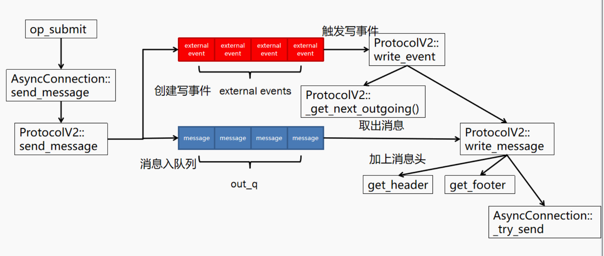

# Ceph 客户端写入流程的控制面与数据面分析

## Ceph RBD 客户端业务流程拆解（写操作）
我们按执行逻辑列出关键步骤（暂时忽略不同feature支持的分支功能），并注明每一步的作用以及是否涉及对用户真实数据的操作。
### 1. 发起写入请求(IO层)

- **描述：**  应用程序通过 ```librbd``` 调用写入接口```rbd_write()```，进入 Ceph RBD 客户端的IO层。对应实现上，```Io<I>::write(image_ctx, off, len, bl, op_flags)``` 被调用。

- **功能：** 初始化写入操作。准备写入所需的上下文信息，传入镜像（image）的上下文 image_ctx、偏移量 off、写入长度 len、包含用户数据的缓冲区列表 bufferlist bl 以及操作标志等。对于同步写，内部实际上调用异步写接口 ```Io<I>::aio_write(..., native_async=false)``` 来完成同步操作。

- **是否涉及数据：否。** 仅仅是函数调用和参数传递，尚未对 bufferlist 中的实际数据内容进行处理或复制。

```cpp
ssize_t Io<I>::write(
    I &image_ctx, uint64_t off, uint64_t len, bufferlist &&bl, int op_flags)

void Io<I>::aio_write(I &image_ctx, io::AioCompletion *aio_comp, uint64_t off,
                      uint64_t len, bufferlist &&bl, int op_flags,
                      bool native_async)
```

### 2. 准备 AIO 写入请求

- **描述：**  ```Io<I>::aio_write(...)``` 执行异步写的准备工作。首先创建并初始化一个 AioCompletion（异步完成上下文）对象，用于跟踪该写请求的完成情况（开始时间、用于计量延迟等）。接着检查I/O请求的基本有效性（比如偏移和长度是否在镜像范围内）。然后构建一个 ImageDispatchSpec 对象来描述此次写入请求，例如调用 ImageDispatchSpec* create_write(...)。

- **功能：** 组装上层写入请求的描述。ImageDispatchSpec 封装了镜像上下文、调度层标识、写入偏移和长度、目标区域（数据区）、用户提供的待写入数据（bufferlist）等信息，相当于对用户请求的抽象表示，便于后续调度。

- **是否涉及数据：否。** 这一阶段只是创建请求的元数据描述，将用户数据的 bufferlist 纳入请求对象中（通过引用或移动语义），但不对数据本身进行操作。无论读写，ImageDispatchSpec 都只是携带参数的容器，不直接处理数据内容。

```cpp
static ImageDispatchSpec* create_write(
      ImageCtxT &image_ctx, ImageDispatchLayer image_dispatch_layer,
      AioCompletion *aio_comp, Extents &&image_extents, ImageArea area,
      bufferlist &&bl, int op_flags, const ZTracer::Trace &parent_trace)
```

### 3. 请求调度与 ImageRequest 创建

- **描述：**  创建好的 ImageDispatchSpec 随即通过调度层发送。具体地，```ImageDispatch<I>::write(...)``` 被调用，它会进一步调用 ```ImageRequest<I>::aio_write(...)``` 来实际启动异步写流程。该调用会实例化一个 ```ImageWriteRequest``` 对象（继承自 AbstractImageWriteRequest），将刚才准备的参数传入，包括镜像上下文 (m_image_ctx)、完成对象 (aio_comp)、写入范围 (image_extents)、区域信息 (area)、数据内容 (bl)、操作标志 (op_flags)、父跟踪信息 (parent_trace)。随后，进入 AbstractImageWriteRequest<I>::send_request() 方法，开始处理该 ImageWriteRequest。

- **功能：** 指定镜像上下文、设置调度层为 IMAGE_DISPATCH_LAYER_API_START、提供完成对象、设置读取范围 (off, len)、指定区域为 DATA 区域、用户写入的真实数据、提供操作标志、提供跟踪信息。ImageWriteRequest 对象保存了所有与此次写入相关的信息，并提供后续执行所需的方法。

- **是否涉及数据：否。** 这一阶段依然在组装请求和调用下一层逻辑，没有修改或拆解实际数据。数据缓冲区 bufferlist 作为参数被传递给 ImageWriteRequest 对象，但仍未发生数据内容操作。

```cpp
bool ImageDispatch<I>::write(
    AioCompletion* aio_comp, Extents &&image_extents, bufferlist &&bl,
    int op_flags, const ZTracer::Trace &parent_trace,
    uint64_t tid, std::atomic<uint32_t>* image_dispatch_flags,
    DispatchResult* dispatch_result, Context** on_finish,
    Context* on_dispatched)

void ImageRequest<I>::aio_write(I *ictx, AioCompletion *c,
                                Extents &&image_extents, ImageArea area,
                                bufferlist &&bl, int op_flags, const ZTracer::Trace &parent_trace)

void AbstractImageWriteRequest<I>::send_request()
```

### 4. 映像层写入请求处理（send_request）

- **描述：**  
1.检查日志状态
2.遍历所有镜像范围 (m_image_extents)：跳过长度为 0 的范围、调用 area_to_object_extents 将镜像范围转换为对象范围、累加写入长度到 clip_len
3.调用 prune_object_extents 修剪对象范围：返回值 ret == 1 表示范围有变化，需要反向更新镜像范围
4.发送对象请求：获取最新的 IO 上下文 (get_data_io_context)、调用 send_object_requests 发送实际的对象写入请求

- **功能：** 将高层的镜像写入请求转换为一系列对象级别的写操作。RBD 客户端在这里完成了**地址映射和请求拆分**：即确定用户想写入的那些字节最终属于集群中哪些对象以及偏移，从而把一个大请求拆分为若干独立的对象写操作。

- **是否涉及数据：否。** 这一阶段非常重要但完全属于控制面逻辑：进行计算和元数据处理，没有触及用户实际数据内容。特别地，area_to_object_extents 仅根据偏移和长度计算映射关系，它不需要访问 bufferlist 中的数据，只需知道数据长度即可。因此，到目前为止，用户数据仍然只是被引用传递，没有被读取或修改。

```cpp
template <typename I>
void area_to_object_extents(I* image_ctx, uint64_t offset, uint64_t length,
                            ImageArea area, uint64_t buffer_offset,
                            striper::LightweightObjectExtents* object_extents)
    Striper::file_to_extents(image_ctx->cct, &image_ctx->layout, offset, length,
                            0, buffer_offset, object_extents);
```

### 5. 发送对象写请求（对象层处理）

- **描述：**  send_object_requests 遍历所有对象范围 (object_extents)，为每个对象范围创建新的完成回调 (C_AioRequest) 通过 create_object_request 创建具体的对象请求 ⽴即发送请求 (request->send())

- **功能：** 这一阶段将高层拆分得到的每个对象写操作具体化，并真正触发它们的执行。

- **是否涉及数据：否。** 在遍历每个对象extent时，主要工作仍然是控制调度和对象请求构建。

```cpp
void AbstractImageWriteRequest<I>::send_object_requests(
    const LightweightObjectExtents &object_extents, IOContext io_context,
    uint64_t journal_tid)
```

### 6. 对象写请求执行与提交（RADOS 层）

- **描述：** 对于每个通过 ObjectDispatchSpec 发出的对象请求，Ceph 客户端的对象调度层会执行实际的写入操作。以一个对象请求为例：ObjectDispatch<I>::write(...) 方法被调用，它会根据传入参数创建一个 ObjectWriteRequest 对象。这个对象封装了对单个 RADOS 对象的写操作，包括对象ID、偏移、数据缓冲、标志。创建后立即调用 ObjectWriteRequest->send()，进入 AbstractObjectWriteRequest<I>::send() 处理。
    - **预写处理**：在真正发送数据前，pre_write_object_map_update() 用于决定写入前的准备动作，主要包括两方面：
        - **copyup** 如果当前对象可能尚不存在于镜像中（例如这是对一个从未写入过的偏移执行写，且镜像基于父镜像克隆而来），并且启用了copyup机制，那么需要执行 copyup()。Copyup 操作会从父镜像读取该对象的现有数据，将数据提升到当前镜像。这通常是在镜像分层场景下发生的：例如镜像是从父快照创建的克隆，而此对象从未被克隆写入过，则需要先把父级的数据读上来，再融合新写入的数据，否则直接写会造成未写部分的数据丢失继承问题。Copyup 本质上是一个读取操作，会向集群发送读取请求把父对象的数据取回。这一步会产生真实数据的读取（数据面），读取的数据大小通常等于一个对象大小，然后在客户端将用户提供的新数据覆盖到相应偏移，得到完整的数据块用于写入。
        - **Object Map** 如果镜像启用了Object Map，用于记录哪些对象已存在以优化空间和加速操作，并且当前对象从不存在变为将要存在，那么需要更新对象映射。对象映射更新涉及很小的元数据 I/O，不会处理大块数据。
        - **默认情况** 直接调用 write_object() 。
    - **执行写入** ：AbstractObjectWriteRequest<I>::write_object() 负责将准备好的数据发送给 Ceph OSD：
        1. 写⼊操作准备
        2. 写⼊条件检查（Guarding）
        3. 实际写⼊操作组装
        4. 异步执⾏写⼊ 通过 rados_api.execute 提交到 RADOS 层： 指定对象名称(data_object_name) 传递 I/O 上下⽂ (m_io_context) 写操作(write_op) 设置完成回调 (handle_write_object) 可选传递跟踪信息 (m_trace)


- **功能：** 这一阶段实现了真正的数据写入提交工作。客户端在这里与 Ceph 集群交互，将之前准备好的每个对象写操作提交给对应的 OSD。关键动作包括可能的copyup、元数据更新以及通过 librados 汇集操作并交由 Objecter 发送网络消息。

- **是否涉及数据：与feature支持有关，涉及copyup等等涉及。** 

```cpp

ObjectDispatchSpec *ImageWriteRequest<I>::create_object_request(
    const LightweightObjectExtent &object_extent, IOContext io_context,
    uint64_t journal_tid, bool single_extent, Context *on_finish)

static ObjectDispatchSpec* create_write(
      ImageCtxT* image_ctx, ObjectDispatchLayer object_dispatch_layer,
      uint64_t object_no, uint64_t object_off, ceph::bufferlist&& data,
      IOContext io_context, int op_flags, int write_flags,
      std::optional<uint64_t> assert_version, uint64_t journal_tid,
      const ZTracer::Trace &parent_trace, Context *on_finish)

bool ObjectDispatch<I>::write(
    uint64_t object_no, uint64_t object_off, ceph::bufferlist&& data,
    IOContext io_context, int op_flags, int write_flags,
    std::optional<uint64_t> assert_version,
    const ZTracer::Trace &parent_trace, int* object_dispatch_flags,
    uint64_t* journal_tid, DispatchResult* dispatch_result,
    Context** on_finish, Context* on_dispatched)

    void AbstractObjectWriteRequest<I>::pre_write_object_map_update()

    void AbstractObjectWriteRequest<I>::write_object()

    auto execute(Object o, IOContext ioc, WriteOp op,
                CompletionToken&& token, uint64_t* objver = nullptr,
                const blkin_trace_info* trace_info = nullptr)
        void RADOS::execute_(Object o, IOContext _ioc, WriteOp _op,
                    WriteOp::Completion c, version_t* objver,
                    const blkin_trace_info *trace_info)

void mutate(const object_t& oid, const object_locator_t& oloc,
	      ObjectOperation&& op, const SnapContext& snapc,
	      ceph::real_time mtime, int flags,
	      Op::OpComp oncommit,
	      version_t *objver = NULL, osd_reqid_t reqid = osd_reqid_t(),
	      ZTracer::Trace *parent_trace = nullptr)

void Objecter::op_submit(Op *op, ceph_tid_t *ptid, int *ctx_budget)
    void Objecter::_op_submit_with_budget(Op *op, shunique_lock<ceph::shared_mutex>& sul, ceph_tid_t *ptid, int *ctx_budget)
    void Objecter::_op_submit(Op *op, shunique_lock<ceph::shared_mutex>& sul, ceph_tid_t *ptid)
    void Objecter::_send_op(Op *op)

int AsyncConnection::send_message(Message *m)
    void ProtocolV2::send_message(Message *m)
```

### 7. 消息发送与网络传输（Messenger 层）

- **描述：** Ceph 客户端使用 Messenger 子系统（AsyncConnection/ProtocolV2 等）将封装好的消息发送给目标 OSD。

    - **消息入队** 前一步的 send_message(m) 调用，将消息加入对应连接的发送队列。AsyncConnection::send_message 先确保消息的优先级等信息设置正确，记录源地址等，然后调用协议层的 ProtocolV2::send_message。​实际发送过程由 Messenger 的事件驱动机制执行。

    - **发送主循环** 在网络线程中，ProtocolV2::write_event() 负责处理发送队列​，其主要流程：
    1. 尝试发送已排队数据
    2. 获取下一条待发送消息(_get_next_outgoing)
    3. 非lossy连接需维护已发送列表
    4. 准备消息(prepare_send_message)  **这一步的 CRC 计算会对用户数据逐字节计算校验值，编码后、发送前，会对消息进行加密，显著数据面开销**。
    5. 实际写入消息(write_message)
- **功能：** Messenger 层将客户端准备好的消息可靠地传输给 OSD。这个阶段几乎纯粹是数据面的传输，包括对数据的封包、校验、加密，以及通过网络发送。

- **是否涉及数据：是。** 这一阶段对用户数据的处理包括：计算CRC，可能的加解密等等。



```cpp
void ProtocolV2::write_event()
    ProtocolV2::out_queue_entry_t ProtocolV2::_get_next_outgoing()
    void ProtocolV2::prepare_send_message(uint64_t features, Message *m)
        void Message::encode(uint64_t features, int crcflags, bool skip_header_crc)
    ssize_t ProtocolV2::write_message(Message *m, bool more)
```

```cpp
struct ceph_msg_header {
	__le64 seq;       /* message seq# for this session */
	__le64 tid;       /* transaction id */
	__le16 type;      /* message type */
	__le16 priority;  /* priority.  higher value == higher priority */
	__le16 version;   /* version of message encoding */

	__le32 front_len; /* bytes in main payload */
	__le32 middle_len;/* bytes in middle payload */
	__le32 data_len;  /* bytes of data payload */
	__le16 data_off;  /* sender: include full offset;
			     receiver: mask against ~PAGE_MASK */

	struct ceph_entity_name src;

	/* oldest code we think can decode this.  unknown if zero. */
	__le16 compat_version;
	__le16 reserved;
	__le32 crc;       /* header crc32c */
} __attribute__ ((packed));
struct ceph_msg_footer {
	__le32 front_crc, middle_crc, data_crc;
	// sig holds the 64 bits of the digital signature for the message PLR
	__le64  sig;
	__u8 flags;
} __attribute__ ((packed));

ssize_t AsyncConnection::_try_send(bool more)
    ssize_t send(ceph::buffer::list &bl, bool more)
        static ssize_t do_sendmsg(int fd, struct msghdr &msg, unsigned len, bool more)
            ::sendmsg(fd, &msg, MSG_NOSIGNAL | (more ? MSG_MORE : 0))
```

简而言之，Ceph 客户端在写入时主要做了四件事：1）解析用户写入请求、拆分定位到对象（控制层）；2）必要时准备数据（copyup等等，数据面）；3）将请求提交给集群目标（协调通信，不碰数据）；4）对数据进行传输层处理并发送给OSD（对数据进行校验、加密并发送，数据面且开销大）。这些步骤中，决策和协调属于控制面，数据传输和处理属于数据面。

第二件与第四件本质是需要对数据内容本身操作。除此之外，例如ceph_msg_header传输部分中的data_len等数据特性的参数，数据面卸载后bl.length始终为0，需要np实现对应等逻辑（需讨论）。